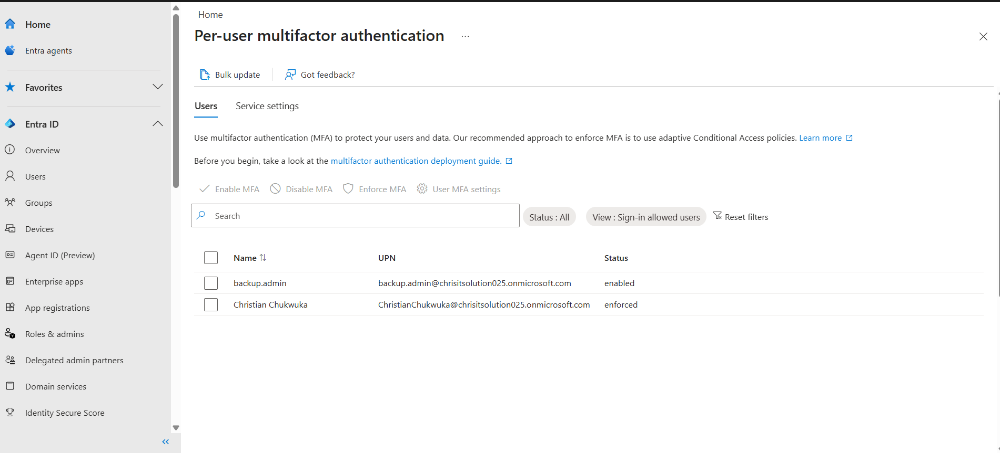
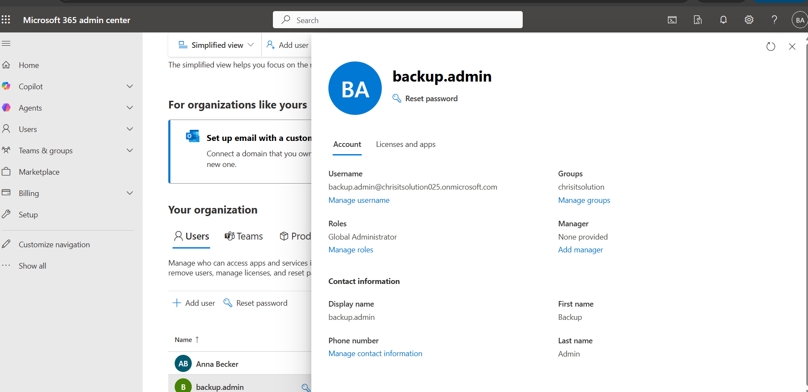

# IAM-03 — Conditional Access (MFA Enforcement)

## 🔹 Control Objective
Ensure secure access to Microsoft 365 resources by enforcing Multi-Factor Authentication (MFA) for privileged accounts.

---

## 🔹 Description
Conditional Access policies are used to enforce security requirements based on user roles, risk, and access conditions.

In this lab, a policy was created to enforce MFA for administrative accounts.

---

## 🔹 Scope
- Microsoft Entra ID (Azure AD)
- All cloud applications
- Privileged users (Global Administrators)

---

## 🔹 Implementation Steps

1. Navigate to Microsoft Entra Admin Center  
2. Go to:
   Security → Conditional Access  
3. Click: New Policy  
4. Policy Name:
   CA-01-Admin-MFA-Enforced  

### Assignments:
- Users:
  Include → Global Administrators  
  Exclude → Emergency account (backup.admin)

- Target Resources:
  All cloud apps  

### Access Controls:
- Grant → Require Multi-Factor Authentication  

### Enable Policy:
- Set to: ON  

---

## 🔹 Evidence

### 🔸 Conditional Access Policy

### 🔸 Global Admin Assignment

---

## 🔹 Result
- MFA enforced for admin accounts  
- Normal users not affected  
- Emergency access maintained  

---

## 🔹 Risk Mitigated
- Credential theft  
- Unauthorized privileged access  
- Brute force attacks  

---

## 🔹 Status
Implemented ✅
