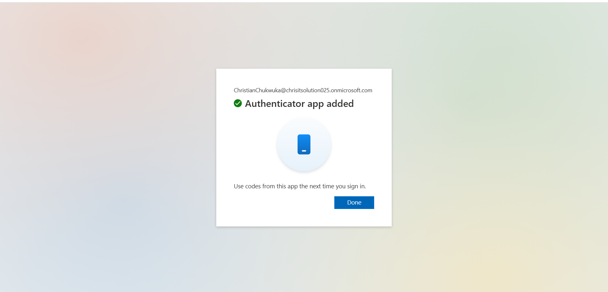
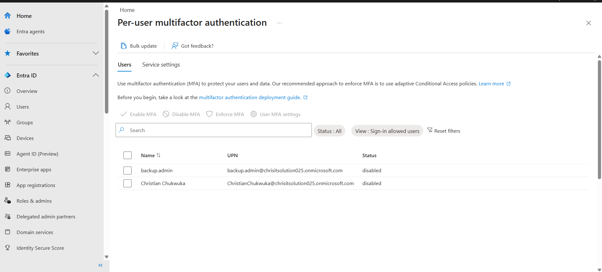
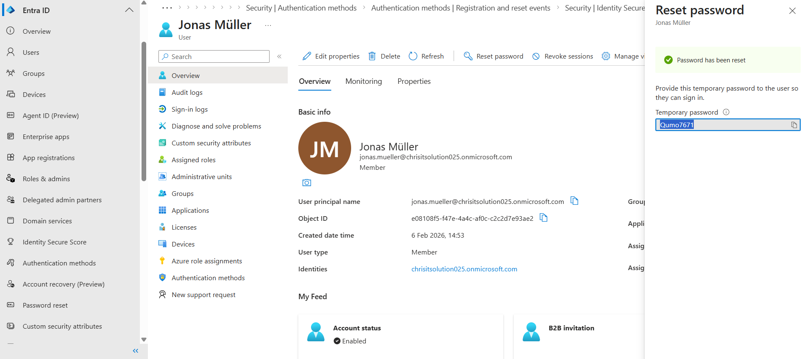
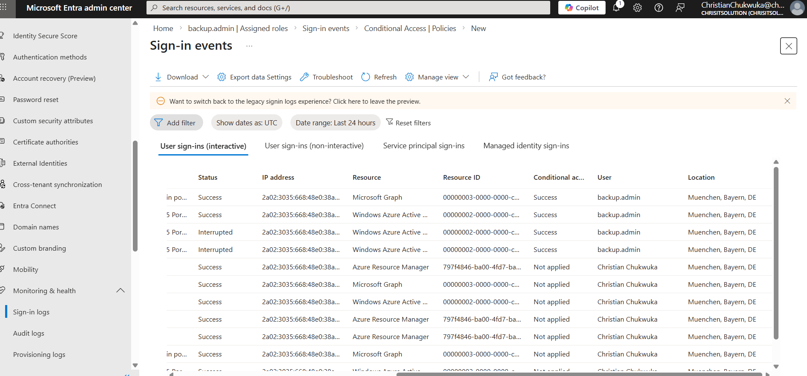

# Conditional Access Configuration Evidence

## 🔹 MFA Registration

---

## 🔹 MFA Challenge

---

## 🔹 Password Reset (Admin Action)

---

## 🔹 Sign-In Logs Validation

---

## 🔹 Analysis

- backup.admin → Conditional Access: **Success**
- Christian → Conditional Access: **Not Applied**

### Explanation:
The policy targets only privileged accounts, therefore normal users are excluded.

---

## 🔹 Conclusion
Conditional Access policy successfully enforced MFA for administrators and validated via sign-in logs.
